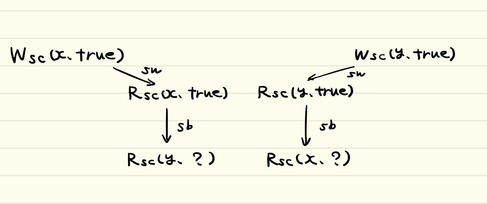

# (RFC)(WIP) CPUと、コンパイラと、C++

# Abstract
Mutexを用いない、lock-freeな並列処理プログラムを作るときに、Shared memory multiple processorにおける
Consistency modelを理解する必要が出てきた。CPU, コンパイラ, C++のそれぞれについて調べたが、
それらを横断して説明しているような資料、また一般的な(分散システムにおける)Consistency modelとの繋がり
について説明された資料が見当たらなかったため、ここに個人用の**メモ書き**を記しておく。
また、個人的な解釈についても記述しておく。

CPU、コンパイラ、C++の順で説明していく。

# Introduction
複数のProcessor上で動くプログラムの挙動を把握するのは難しい。
しかしながら、TSOを仮定すればプログラムの処理を一つのシーケンスとして捉えることができるので、挙動の具体例を挙げやすくなる。
C++のmemory modelをグラフ化する方法を使えば、どのような結果が発生するか/しないかを証明することができる。
以下ではそれらについて説明していく。

# CPU
## Sequential Consistencyとrelax
Multi processorなプログラムは、Uni processorなプログラムに比べて挙動が把握しにくい。
コンパイラとCPUが高速化のために操作の入れ替えなどを行うからである。
どの種類のCPUもSequential Consistencyを実現する命令を提供する。これは、プログラムはソースコードと同じ流れで実行され、
メモリへの書き込みは一つのシーケンスとして捉えられるconsistency modelである。しかしながら、このconsistencyを強制すると
実行速度に大きな影響を与える。

そこで、よりrelaxされたconsistency modelが必要となる。例えば、

- 別アドレスへのwrite同士をreorderできるようにする(W->W reorder)
- 別アドレスへのread同士をreorderできるようにする(R->R reorder)
- アドレスaのread->アドレスbのwrite(a≠b)をreorderできるようにする(R->W reorder)
- アドレスaのwrite->アドレスbのread(a≠b)をreorderできるようにする(W->R reorder)
- 他のProcessorのアドレスaへのwriteが完了する前に、アドレスaを読み込んでもよい(Read Other's Write Early)
- 自分のProcessorのアドレスaへのwriteが他のProcessorから見えるようにする前に、アドレスaを読み込んでもよい(Read Own Write Early)

ここで、同じアドレスへのw->r, r->w, w->wは一般に入れ替えができないことに気を付ける(以下の節参照)。

各種CPUは高速化のためにこれらのrelaxのうち幾つかを適用する。また、各種CPUはreorderが発生しないことを強制する
機構(fenceと呼ぶよりは、safety netと呼ぶ方が適切であろう)を提供するが、これもCPUによって全く異なる。
このため、CPUによってconsistency modelが
異なってしまうことが問題となる(後に説明するように、C++のmemory modelはこれらの違いを隠蔽・抽象化したものとなっている)。


## Data dependency
### Flow (True) Dependence (RAW: Read After Write)
```
x = 10
y = x + c
```
w(x)->r(x)で、一般にはreorderできない

### Anti Dependence (WAR: Write After Read)
```
x = y + c
y = 10
```
r(y)->w(y)

### Output dependence (WAW)
```
x = 10
x = 20
```
w(x)->w(x)
### Input dependence (RAR)
```
y = x + 3
z = x + 3
```
r(x)->r(x). (一般にはreorderが許される)

## TSO

ここでは各種CPUのうち、x86などのTSO(Total Store Order)について説明を行う。
TSOは上のうち、

- W->R reorder
- Read Own Write Early

を許容している。

逆にいえば、

- (他アドレスへの)W->Wはreorderされない
- R->Rはreorderされない
- R->Wはreorderされない
- 他のProcessorのアドレスaへのwriteが完了してから、アドレスaを読み込む

ということが保証されている。このことから次のことが言える。

一つのプロセッサ内でのW->Wの順は守られる。また、他のProcessorのwriteが終わってから
readをする。故に、「あるProcessorの書き込みの順序は、他のProcessorから見たときにも同じように見える」
ということである。つまり、
「W->Rのreorderは発生するも、そのreorder後のプログラムの流れ、メモリへの読み書きは
一つのシーケンスとして捉えることができる」ということである。

これにより、TSO上で並列プログラムの挙動を捉えるのが比較的簡単となる。後に説明するが、
一般のCPU上で並列プログラムの挙動を捉えるには、実行順序が巡回さえしているかのように見えるグラフを用いる
必要があるが、TSOについては次のようなテーブル形式でプログラムの挙動を捉えても良いと言える。

テーブル形式での実行順序記述のルール:

- 時間軸は下方向
- 一つの行には一つのProcessorからの処理しかかかない(同じデータに対する読み書きは同時には発生しない、また可読性のため)


また、TSOがどのようにしてsafety netを提供するかについて説明する。
TSOはatomicなRead-Modify-Writeを挿入するだけでreorderを防げる。

`w(x)r(y)`についてはTSOの規約によりreorderが発生する可能性があるが、
`[dummy-r(x) w(x)]r(y)`とすると、R->Rがreorderできなくなるという規約によって、これについても
reorderが発生しないことを保証する。

なお、x86はrelaxについてTSOとは少し異なるケースがあるらしい、詳しくは[5]を参考に。


# コンパイラ
コンパイラは、プログラマが書くC++と、ハードウェアが実行するプログラムの橋渡し役として機能する。
コンパイラは、C++のmemory modelの規約を元に、コンパイル時にreorderをしないという約束を、プログラマとする。
コンパイラは、C++のmemory modelの規約を元に、CPUにreorderをさせないという約束を、プログラマとする。

ただし例外はある。std::atomic_thread_fenceにmemory_order_seq_cstを指定した時の挙動はCPUによって
違うらしい([3]より)


GCCのatomic built-inとC++のstd::atomicの違いはまだあまり調べられていないので要調査(扱えるデータ型の違い程度？)

また、コンパイラレベルのfenceとC++レベルのfenceは異なることに留意。

C++のatomic_thread_fenceはその前後のreorderを防ぐ&前後の操作にmemory orderのsemanticsを与えるのに対し、
コンパイラレベルのfenceはその前後のreorderを防ぐだけである。
たとえばGCCなら`asm volatile("" ::: "memory");`、MSVCなら(x86に対しては)`_ReadWriteBarrier();`でfenceを記述する。

# C++
## memory model
C++のmemory modelは各アーキテクチャごとのconsistency modelを隠蔽し、より一般的なconsistency modelを与える。　　
例えば、memory_order_relaxedは、

- 一つのProcessor内のW->Wのreorder
- 他のProcessorから見た時の変更順序の入れ替わり

の違いを隠蔽したものと言える。

ここでは、[3]に基づいてプログラム中のmemory modelをグラフ化し、
プログラムを実行したときにどのような挙動が発生するか/発生しないかを示す方法を説明する。
ただし論文中と同じようにmemory_order_consume, std::atomic_thread_fenceにmemory_order_seq_cstを指定した時の挙動, fence同士のsynchronizeについては考えない。
また、簡単のためにコンパイラは以下の手順でfenceの書き換えを行うと考えるものとする(これは正しい手法では無いが、簡単のためひとまず受け入れる)

1. fence前後のコードについて、それぞれreorderをする(fence前後のコードのreorderは発生しない)
2. fenceがrelease fenceである場合にはそのfenceより下の操作にrelease semanticsを、
acquire fenceである場合にはそのfenceより上の操作にacquire semanticsを与える。
3. もう一度reorderをする。


各memory_orderについて簡単な説明をする。

- relaxed: 操作がatomicに行われること、同じアドレスのデータに対しての操作は入れ替わらないこと(Data dependencyによる大前提)のみを保証する。relax operation同士のreorderは発生しうる。
- release: この操作以前のrelaxed操作が、この操作より後にreorderされないことを保証する。(この操作以降のrelaxed操作が、この操作より前にreorderされないことは保証しない。)
- acquire: この操作以降のrelaxed操作が、この操作より前にreorderされないことを保証する。(この操作以前のrelaxed操作が、この操作より後にreorderされないことは保証しない。)
- acq_rel: release semantics & acquire semanticsを持つ
- seq_cst: release semantics & acquire semanticsを持つことに加え、seq_cst同士の操作がtotal orderとなることを保証する。(Sequential Consistencyの実現)

acquire/releaseについては、Release consistencyとかなり似た性質を持つと言える。


次に、sequentially-before, synchronize-with, happens-beforeについて簡単な説明をする。

- sequentially-before: ある操作が、別の操作の前におきる関係
- synchronize-with: ある操作が別のスレッドの操作からreads fromをし、
かつreadする操作がacquire semantics, writeする操作がrelease semanticsを持っているときに持たれる関係
- happens-before: sequentially-beforeとsynchronize-withから作られる推移的閉包([3]では`(sb ∪ sw ∪ asw)+` で表現)で、この関係が成り立てば、プログラムはその順で実行されたと見做すことができる。

以下、それぞれsb, sw, hbと表記する。
これらの関係はコンパイル時に決まるとは限らない。例えば、以下のようなコードを考える。
(以降、サンプルコード中のw1~w4関数はスレッドを表し、プログラムの実行時にそれらのスレッドが同時に立ち上がるとする。)

```c++
std::atomic_int x{0};

void w1(){
  x.store(23, std::memory_order_release); // (1)
}

void w2(){
  // x.load(std::memory_order_acquire); (A)
  // while(x.load(std::memory_order_acquire)); (B)
}
```

(A)をコメントアウトした場合、コンパイル時に(A)が(1)とswするかどうかはわからない。
もしたまたま(A)が23を読み出したら((A) reads from (1)なら)、(1)とsw関係を持つし、
そうでないなら、sw関係は持たない。

(B)をコメントアウトした場合、(B)は(1)からの書き込みが行われるまで待つ、つまり必ずsw関係をもつため、
(B)が(1)とsw関係を持つことは、コンパイル時にわかる。

次に、以下のようなコードを考える

```c++
std::atomic_int x{0};
std::atomic_int y{0};


void w1(){
  x.load(std::memory_order_relax); // A
  y.load(std::memory_order_relax); // B
}
```

AとBはrelax semanticsをもつため、reorderされるかもしれない(あるいは、されないかもしれない)。
もしreorderされないならA sb B, されるならB sb Aとなるので、これはコンパイル時には決定できない。


## 具体例とそのグラフ化

```c++
std::atomic_bool x = false, y = false;
std::atomic_int z = 0;

void w1(){
  x.store(true, std::memory_order_seq_cst);
}

void w2(){
  y.store(true, std::memory_order_seq_cst);
}

void w3(){
  while(!x.load(std::memory_order_seq_cst));
  if(y.load(std::memory_order_seq_cst))
    ++z;
}

void w4(){
 while(!y.load(std::memory_order_seq_cst));
  if(x.load(std::memory_order_seq_cst))
    ++z;
}
```

このプログラムを実行した後、zは2,1のどちらかになり、0には決してならないことを示す。
このプログラムを[3]と同じようにグラフ化するとこのようになる。




(rfなどによるcyclicは発生してもおかしくない)(ここら辺はまだ整備されていない)


また、各orderとhbとconsistency modelとの関連について

sbは実行時に決定する
swも

while loadの例


次にあの論文と、本から


いつもお世話になっている研究室の先生・先輩方、
Twitter経由で非常に参考になる論文・記事を紹介して下さった他大学の先生、ありがとうございます。

# 参考文献
1. Anthony Williams, "C++ Concurrency in Action", Manning Publications.
2. Shared Memory Consistency Models: A Tutorial (https://www.hpl.hp.com/techreports/Compaq-DEC/WRL-95-7.pdfhttps://www.hpl.hp.com/techreports/Compaq-DEC/WRL-95-7.pdf)
3. Common Compiler Optimisations are Invalid in the C11 Memory Model and what we can do about it(http://plv.mpi-sws.org/c11comp/popl15.pdf)
4. std::atomicの挙動がメモリオーダーによってどう異なるか (https://uchan.hateblo.jp/entry/2020/06/14/172543)
5. x86/x64におけるメモリオーダーの話 (https://github.com/herumi/misc/blob/master/cpp/fence.md)
6. Consistency model(https://en.m.wikipedia.org/wiki/Consistency_model)
7. Dependence analysis(https://en.m.wikipedia.org/wiki/Dependence_analysis)