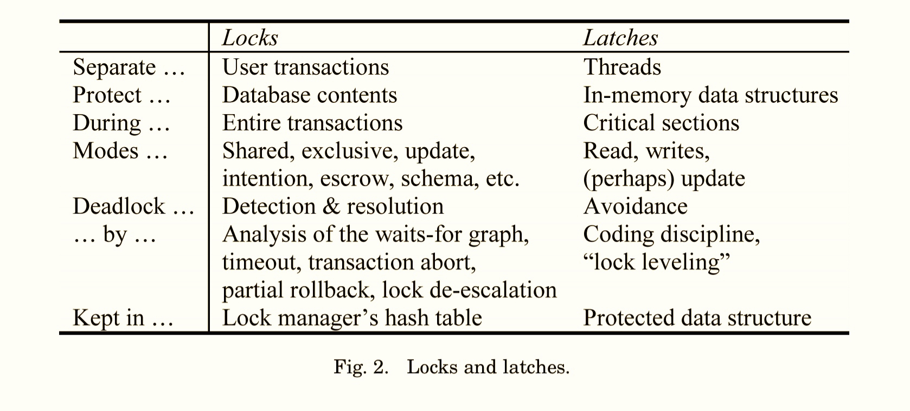
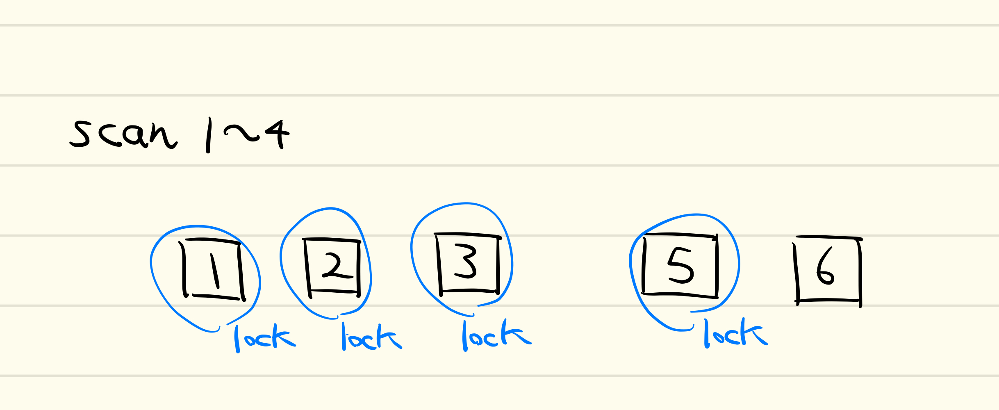
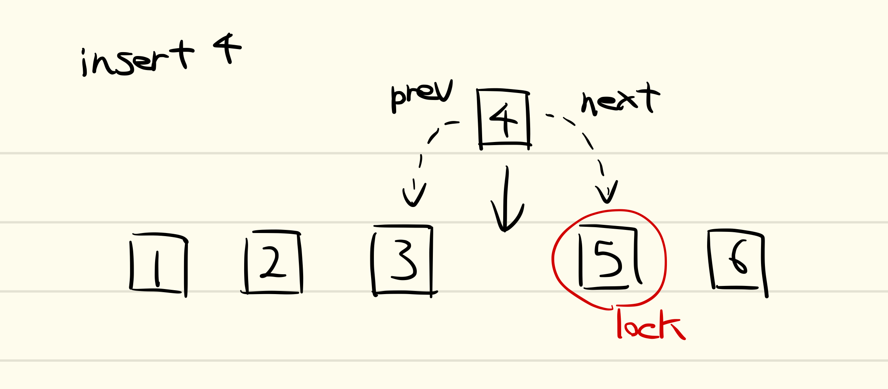
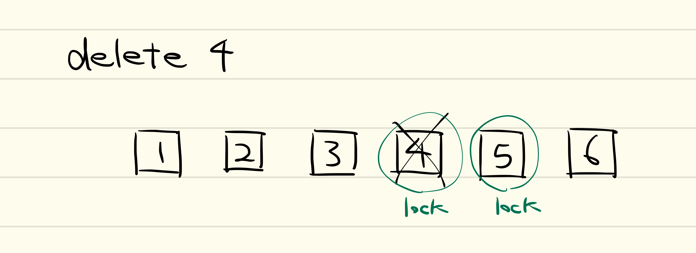
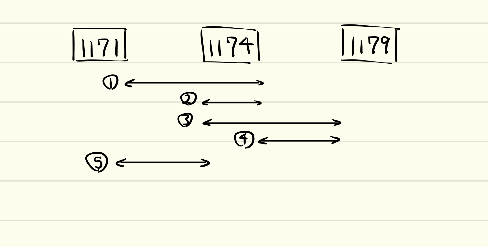
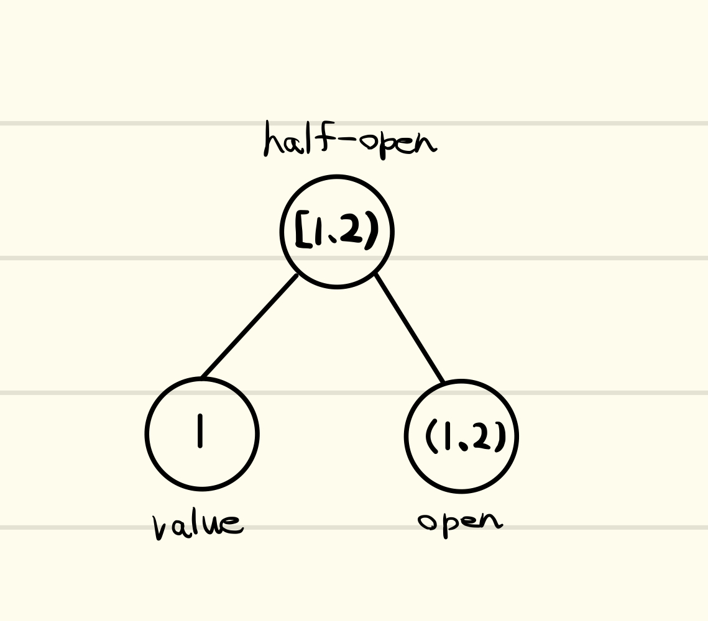
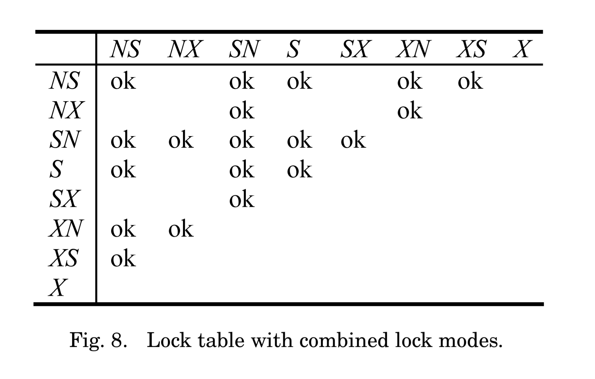
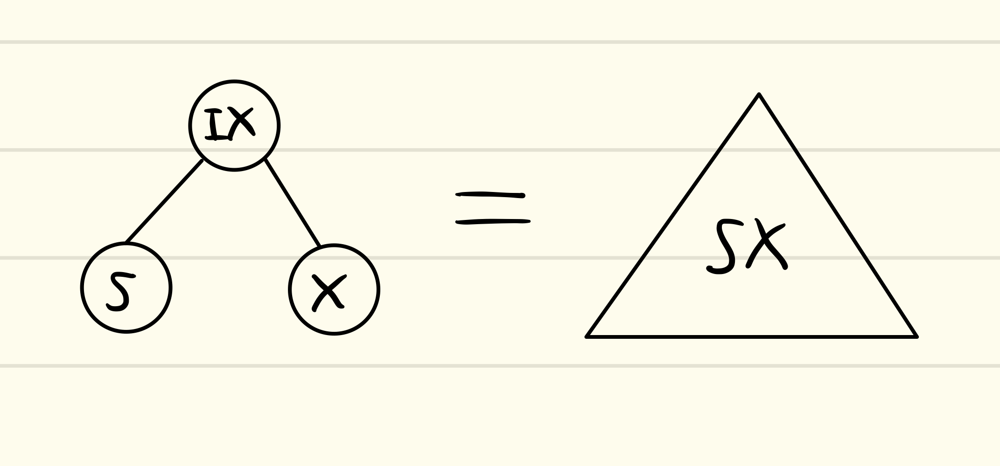

# About

[A survey of B-tree locking techniques]の説明を補足する資料。


# 目次
- Locks and Latches
- Lock-Free B-Trees
- Key Range Locking
- Key Range Locking as Hierarchical locking

# 指針
- 後から何度でも見返せるように、プレゼン資料では失われがちな、最低限の「つなぎ」となる文章を入れる
- 具体例を十分にあげる
- B-treeの並行性制御とRange Queryに注目し、Recoveryの話題は扱わない

# 3.1 Locks and Latches

まずは、よく混同しやすいlockとlatchの違いについてまとめておく。



lockは、
- pageやB-treeのkeyなどのデータベースのコンテンツを保護するために、
- shared, exclusiveなどのモードを使って 
- 複数のトランザクションからの操作を分ける。

[ARIES/KVL]では論理ロックと呼んでいる。

deadlockは、
- wait for graphのチェック等によって検知し、
- transaction abort等によって解決される

lockの情報はlock managerのhash tableに保存される。
lock処理は通常、高価なものとなる。これは、中央で管理されるhash tableに複数のスレッドからのアクセスが発生し、キャッシュミスが多発するからである。lockの対象となるデータは、メモリ上になかったり、あるいはデータベース上にないものも扱うので、latchと違いlock tableの導入が必要となる。

latchは
- buffer pool中のB-tree pageやbuffer poolの management tableなど、 メモリ中のデータ構造を保護するために、
- read, writeなどのモードを使って 
- 複数のスレッドからの操作を分ける

[ARIES/KVL]では物理ロックと呼ぶ

dead latchは、
- 発生しないように十分注意してプログラムすることによって回避

latchの情報は、保護の対象となるデータ構造に埋め込む。

latch処理は通常、安価なものとなる。これは、保護対象のデータ構造の中にlatchの情報が埋め込まれるため、
中央データ構造での管理が発生しないため、比較的キャッシュミスが発生しにくい。


# 3.2 Recovery and B-Tree Locking

Recovery時におけるcompensation logやanalysis phaseにおけるlockと
latchの役割の違い。ここは[ARIES/KVL]を参照しよう。

# 3.3 Lock-Free B-Trees 
定義が曖昧なlock-freeについておさらいする。
全体をMutexで保護し、並行処理を可能にしたデータ構造はlock-freeとは言えない。複数のスレッドが同時にそのデータ構造
を操作することができないからである。

通常のMutexは、スレッドの動作を一時停止させるようなOSのシステムコールを用いて実装している。
このように、スレッドの動作を一時停止させるようなOSのシステムコールをblocking callと呼ぶ。

Mutexはblocking callを用いずに実装することが可能である。例えば、以下のコードのようにtest and setで実装することができる

```c++
#include <atomic>
class spinlock_mutex{
  std::atomic_flag flag;
  
public:
  spinlock_mutex(): flag(ATOMIC_FLAG_INIT)
  {};
  
  void lock(){
    while(flag.test_and_set());
  }
  
  void unlock(){
    flag.clear();
  }
};
```

ここでは、test and setが成功するまでwhile loopをすることによりロックの確保を実現している。このようなlockの
実装をspin lockという。

spin lockにより、blockingでないmutexを実装することができた。このような実装のmutexを用いるデータ構造を、nonblockingなデータ構造と呼ぶ。しかしながら、次のようなthreadsafeなstackの実装を考えてみよう。


```c++
class threadsafe_stack{
  spinlock_mutex mutex;

public:
  void push(int num){
    mutex.lock();
    ...
    mutex.unlock();
  }

  int pop(){
    mutex.lock();
    ...
    mutex.unlock();
  }
};
```

このstackはnonblockingではあるが、各操作を行うたびにデータ構造全体を保護しているため、lock-freeなデータ構造とは言えない。すなわち、nonblockingであるかどうかと、lock-freeであるかどうかは別問題なのだ。


では、lock-freeはどのように定義できるであろうか？[C++ Concurrency in Action]では、lock-freeとその周辺の用語について以下のようにまとめている。

- Obstruction-Free: もしデータ構造を操作する他の全てのthreadが止まっているならば、一つのスレッドが特定ステップ数以下で処理を完了できるデータ構造。複数の操作が並行に実行されることは無い。
- Lock-Free: もしデータ構造を複数のスレッドが操作しているならば、そのうちの一つのスレッドが特定ステップ数以下で処理を完了できるデータ構造。複数の操作が並行に実行でき、少なくともそれらのうち一つの操作が特定ステップ数以下で処理を完了できる。
- Wait-Free: データ構造を操作している全てのスレッドが、その処理を特定ステップ数以下で完了できるデータ構造。複数の操作が並行に実行でき、全ての操作が特定ステップ数以下で処理を完了できる。

ここで重要なのは、まず「特定のステップ数以下」でない状態というのは、例えばspin loopからしばらく抜け出せない状況を表す。lock-freeのアルゴリズムにおいて、データ構造中で同じメモリにアクセスしないスレッド同士は並行に処理を実行できる。これがObstruction-Freeとlock-freeの違いである。しかしながら、データ構造中にて同じメモリにアクセスするスレッド同士が競合する場合は片方のスレッドはspin-lockなどによって待機する必要がある。これがwait-freeとlock-freeの違いである。spin-lockなどによって、ソースコードから予測できる程度のステップ数以下で処理が完了しなくなる。

もう一つ重要なのは、lock(データベースの文脈ではlatch)の実装に依るのではなく、実行形態がどうなるか、つまり実行単位(スレッド)
とステップ数にのみ注目して定義付けがなされているということだ。blocking callを実装に使っているか否かは定義とはあまり関係がない。

deadlockやlivelock、starvationについても同様に、実行単位とステップ数を用いて定義できる。

形式的な定義にはお目に書かれたことはない。時相論理とか必要になりそう？
[ロックフリー性の証明について]においては、進行保証の証明について上げられている。

# 4. Protecting A B-Tree's physical structure

並行でアクセスできるようなB-Treeを設計する場合、主に以下のような4点の問題があげられる

1. メモリ中のページは、あるthreadが読んでいる間に他のthreadから内容を変更されてはいけない
2. あるスレッドがページ間のポインタを走査している間に、他のスレッドがそのポインタを無効化してはならない
3. ポインタの走査は親子間だけではなく兄弟間でも起こるため、deadlockが発生しないように十分に注意して設計する
4. 子ノードがオーバーフローして親ノードへのキーの挿入が求められる。最悪ケースでは、rootノードのsplitが発生する。

これらの問題に対する解決策をいくつかあげる。
## 4.2 lock coupling

2つめの問題は、子ノードのlatchが獲得できるまで親ノードのlatchを確保することで解決できる。
この手法は、 latch coupling及びhand-over-hand lockingと呼ばれる。

この節ではlock couplingと関係ない話が以降続く。
- I/O時のlatchのリリース、rootからの再探索
- shared・exclusive latchに加えupdate latchを導入する話

が書かれている。

## 4.3 B-link tree
4番目の問題はB-link treeの導入によって簡単になる。
ここでは扱わないが、B-link treeの元論文を読んでEdge caseの挙動を確認すべきであろう。

# 5. Protecting a B-Tree's logical contents

B-Treeの論理的要素をどのように保護するかについての章。lockについて主に扱う。
lock durationやtransaction isolation levelについても[Granularity of Locks]で確認しておこう。

# 5.1 Key Range Locking
Key range lockingはPredicate lockingの特別な形である。純粋なPredicate lockingも、Key Range locking以上に
精度の高いlockingも製品版では扱われていない。　

Key Range lockingとよく混同しがちなのが、scanである。
Key range lockはinsert/delete操作時に、key value間のgapを保護する仕組みである。これに対し、
scanは広い幅のkey中にある複数のデータの読み込みを、一つのatomicな操作として実現する仕組みである。この時、
scanはkey range lockingを複数持つと言える。

Key Range lockingの手法として最も基本的なのは、[ARIES/KVL]で導入されたnext key lockingである。




Next key lockingでは、scan時には終端のkey(ここでは4)の次のkey(ここでは5)のlockを行う。




insertの時には、挿入しようとしているkeyの次のkeyへのlockを試みる。これにより、scan1~4と
insert4がconcurrentに実行されても、next keyのlockにより排他的に実行され、phantom anomalyを避けられる。

deleteの時にも同様に、削除しようとしているkeyの次のkeyへのlockにより、phantom anomalyを避ける。
また、次のkeyのlockにより、rollback時に削除したkeyの復元、すなわち挿入に失敗しなくなることも保証できる。



Key Range lockingで保護できる範囲について考えてみよう。Next key lockingで保護できた範囲は、
①の範囲である。previous key lockingでは③の範囲を保護できる。もしここで、④や
⑤のような範囲について保護できたらどうであろうか？

①はNext key lockingで保護できる範囲、③はPrevious key lockingで保護できる範囲である。
②はkey valueそのものを保護する範囲で、これだけではKey Range lockingには使えない。
④は開区間(1174, 1179)を保護する。ここがlockできると、例えば一つのtransactionが1175の挿入を
している時に、別のtransactionによる1174のrecordのupdateを許容できる。ただし、二つ目のtransactionは
一つ目のtransactionのlockが解放されるまで、1174の削除はできない。⑤も同様の議論ができる。

④や⑤のようなlock、あるいは②と④を組み合わせて③のlockを実現する機構を作ると、Next/Previous key locking以上の
concurrencyを実現できるに違いない。
そこで、今後はlockされる単位として②のようなkey valueと、④のようなopen intervalの二つを扱おう。この二つを
組み合わせればhalf-open intervalとして③のkey range lockingが実現でき、previous key lockingが実現できる。


# 5.2 Key Range Locking and Ghost Records
実際にkey valueをtreeから削除するのではなく、ghost record bitを
使うと、例えばdeleteの時にrollbackを成功させるためのNext key lockingが不要になる。
詳しくはあとでまとめる。

# 5.3 Key Range Locking as Hierarchical locking

5.1節で説明したように、key valueとopen intervalに分ける事により細かいkey rangeの設定が
できるようになった。また、それらを組み合わせることにより、half-open intervalを作り、従来の
next/previous key lockingが実現できた。
ここで生じる問題は、key valueとopen intervalのlockは、それぞれ一回の操作で実現できる。
しかしながら、key valueとopen intervalを組み合わせてできるhalf-open intervalのlockには二回の操作を
必要とする。そこで、multi granularity lockingを使うことによりこの問題を解決できる。

multi granularity lockingについては`multi_granularity_locking.md`を参照。



この手法の欠点は、half-open intervalのlockは一回のlockで済むのに対し、
key valueかopen intervalをlockする場合には、二回のlockが必要になるという点である。

ここで、lock modeを増やすことにより、half-open interval、key value、open intervalのlock
の組み合わせを一つのlockとして表現することにより、これらのlockを一度で行うことが可能になる。
これにより、concurrencyが上がることが期待できる。

half-openはS,X,IS,IXでlockできる(half-open下には二つしかnodeが無いため、
SIXは不要)。key valueとopen intervalはS/X lockができる。
これらのパターンを網羅し、一つのnodeで管理するには、S,X,Nのうち二つから構成される
lockのすべてのパターンを網羅する必要がある。



この表は、key valueとopen intervalのlockを一つにまとめたものである。
一つ目がkey value、二つ目がopen intervalにそれぞれ対応し、互換性は両方のlock
でそれぞれ検証することによって簡単に導ける。SとXはぞれぞれSS・XXと等価になる。



この時、half-openは「暗黙的に」ISかIXになる。例えば、SXの場合は、
それと等価な木構造は上のようになる。この時、half-openはIXに暗黙的に決定される。

# 参考

- [A Survey of B-Tree Locking Techniques] Goetz Graefe.
- [Granularity of Locks and Degrees of Consistency] Gray et al.
- [ARIES/KVL] Mohan C.
- [C++ Concurrency in Action] Anthony Williams.
- [ロックフリー性の証明について] https://kumagi.hatenadiary.org/entry/20141214