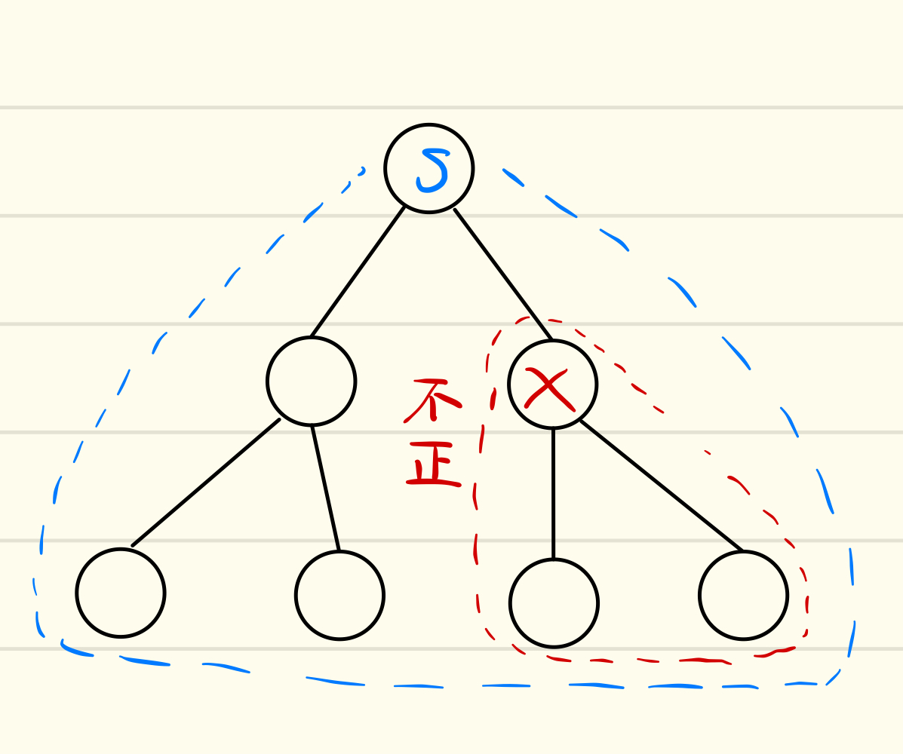

# About
A survey of B-tree locking techniquesのまとめ

# 指針
- 後から何度でも見返せるように、プレゼン資料では失われがちな、最低限の「つなぎ」となる文章を入れる
- 具体例を十分にあげる
- B-treeの並行性制御とRange Queryに注目し、Recoverの話題は扱わない

どこをまとめるか、逆にどこをまとめないで要調査にすべきかしっかり書いておく
これだけ読めばいい、というのは無理がある。自然な文脈はやはり元論文を読んでもらうしか。
SO, I focus to make this document as to do complementary explanation.


# 3.1 B-Treeの二種類の「ロック」

まずは、よく混同しやすいlockとlatchの違いについてまとめておく


lockは、
- pageやB-treeのkeyなどのデータベースのコンテンツを保護するために、
- shared, exclusiveなどのモードを使って 
- 複数のトランザクションからの操作を分ける。

ARIES/KVLでは論理ロックと呼んでいる。

deadlockは、
- wait for graphのチェック等によって検知し、
- transaction abort等によって解決される

lockの情報はlock managerのhash tableに保存される
lock処理は通常、高価なものとなる。これは、中央で管理されるhash tableに複数のスレッドからのアクセスが
発生し、キャッシュミスが多発するからである。lockの対象となるデータは、メモリ上になかったり、あるいはデータベース上
にないものも扱うので、latchと違いlock tableの導入が必要となる。

latchは
- buffer pool中のB-tree pageやbuffer poolの management tableなど、 メモリ中のデータ構造を保護するために、
- read, writeなどのモードを使って 
- 複数のスレッドからの操作を分ける

ARIES/KVLでは物理ロックと呼ぶ

dead latchは、
- 発生しないように十分注意してプログラムすることによって回避

latchの情報は、保護の対象となるデータ構造に埋め込む

latch処理は通常、安価なものとなる。これは、保護対象のデータ構造の中にlatchの情報が埋め込まれるため、
中央データ構造での管理が発生しないため、比較的キャッシュミスが発生しにくい。


# Recovery時のlockとlatchの違い

飛ばす。ARIES/KVL参照


# 3.3 Lock free 
定義が曖昧なlock-freeについておさらいする。
全体をMutexで保護し、並行処理を可能にしたデータ構造はlock-freeとは言えない。複数のスレッドが同時にそのデータ構造
を操作することができないからである。

通常のMutexは、スレッドの動作を一時停止させるようなOSのシステムコールを用いて実装している。
このように、スレッドの動作を一時停止させるようなOSのシステムコールをblocking callと呼ぶ。

Mutexはblocking callを用いずに実装することが可能である。例えば、以下のコードのようにtest and setで実装することができる

```c++
#include <atomic>

class spinlock_mutex{
  std::atomic_flag flag;
  
public:
  spinlock_mutex(): flag(ATOMIC_FLAG_INIT)
  {};
  
  void lock(){
    while(flag.test_and_set());
  }
  
  void unlock(){
    flag.clear();
  }
};
```

ここでは、test and setが成功するまでwhile loopをすることによりロックの確保を実現している。このようなlockの
実装をspin lockという。

spin lockにより、blockingでないMutexを実装することができた。しかしながら、このMutexを用いてもlock-freeには
なりえない。複数のスレッドからの操作が許容されていないことに変わりはないからである。

"C++ Concurrency in Action"では、lock-freeとその周辺の用語について以下のようにまとめている。

- Obstruction-Free: もしデータ構造を操作する他の全てのthreadが止まっているならば、一つのスレッドが特定ステップ数以下で処理を完了できるデータ構造
- Lock-Free: もしデータ構造を複数のスレッドが操作しているならば、そのうちの一つのスレッドが特定ステップ数以下で処理を完了できるデータ構造
- Wait-Free: データ構造を操作している全てのスレッドが、その処理を特定ステップ数以下で完了できるデータ構造

ここで重要なのは、まず「特定のステップ数以下」というのはソースコードから予測できる程度のステップ数以下で処理が完了することを表す。
lockの取得に1000回失敗したりなど、並行処理を実行するたびにステップ数に大きなばらつきがあってはいけない。

もう一つ重要なのは、lock(データベースの文脈ではlatch)の実装に依るのではなく、実行形態がどうなるか、つまり実行単位(スレッド)
とステップ数にのみ注目して定義付けがなされているということだ。blocking callを実装に使っているか否かは定義とはあまり関係がない。

deadlockやlivelock、starvationについても同様に、実行単位とステップ数を用いて定義できる。

形式的な定義にはお目に書かれたことはない。時相論理とか必要になりそう？

# 4.B-Treeの物理構造の保護

並行でアクセスできるようなB-Treeを設計する場合、主に以下のような4点の問題があげられる

1. メモリ中のページは、あるthreadが読んでいる間に他のthreadから内容を変更されてはいけない
2. あるスレッドがページ間のポインタを走査している間に、他のスレッドがそのポインタを無効化してはならない
3. ポインタの走査は親子間だけではなく兄弟間でも起こるため、deadlockが発生しないように十分に注意して設計する
4. 子ノードがオーバーフローして親ノードへのキーの挿入が求められる。最悪ケースでは、rootノードのsplitが発生する。

これらの問題に対する解決策をいくつかあげる。
## lock coupling

2つめの問題は
latch coupling, hand-over-hand lockingとも呼ばれる。

なんかあんまり関係ない話が続いてる。無視。
とはいえど、I/O周りの話はうまくまとめるべきか？
Range 周りに注目したいから飛ばす！

## B-link tree
　
B-linkのedge caseの解説はいいや
しかしながら、やはりコーナーケースの解説は望まれるであろう。
出ないと、「はいはい知っている」になる

# 5. Protecting a B-Tree's logical contents

B-Treeの論理的要素をどのように保護するかについての章。lockについて主に扱う。
lock durationやtransaction isolation levelについても[Granularity of Locks]で確認しておこう。

# 5.1 Key Range Locking
Key range lockingはPredicate lockingの特別な形である。純粋なPredicate lockingも、Key Range locking以上に
精度の高いlockingも製品版では扱われていない。　

Key Range lockingとよく混同しがちなのが、scanである。
Key range lockはinsert/delete操作時に、key value間のgapを保護する仕組みである。これに対し、
scanは広い幅のkey中にある複数のデータの読み込みを、一つのatomicな操作として実現する仕組みである。この時、
scanはkey range lockingを複数持つと言える。

Key Range lockingの手法として最も基本的なのは、[ARIES/KVL]で導入されたnext key lockingである。


Next key lockingでは、scan時には終端のkey(ここでは4)の次のkey(ここでは5)のlockを行う。


insertの時には、挿入しようとしているkeyの次のkeyへのlockを試みる。これにより、scan1~4と
insert4がconcurrentに実行されても、next keyのlockにより排他的に実行され、phantom anomalyを避けられる。

deleteの時にも同様に、削除しようとしているkeyの次のkeyへのlockにより、phantom anomalyを避ける。
また、次のkeyのlockにより、rollback時に削除したkeyの復元、すなわち挿入に失敗しなくなることも保証できる。


Key Range lockingで保護できる範囲について考えてみよう。Next key lockingで保護できた範囲は、
①の範囲である。previous key lockingでは③の範囲を保護できる。もしここで、④や
⑤のような範囲について保護できたらどうであろうか？

①はNext key lockingで保護できる範囲、③はPrevious key lockingで保護できる範囲である。
②はkey valueそのものを保護する範囲で、これだけではKey Range lockingには使えない。
④は開区間(1174, 1179)を保護する。ここがlockできると、例えば一つのtransactionが1175の挿入を
している時に、別のtransactionによる1174のrecordのupdateを許容できる。ただし、二つ目のtransactionは
一つ目のtransactionのlockが解放されるまで、1174の削除はできない。⑤も同様の議論ができる。

④や⑤のようなlock、あるいは②と④を組み合わせて③のlockを実現する機構を作ると、Next/Previous key locking以上の
concurrencyを実現できるに違いない。
そこで、今後はlockされる単位として②のようなkey valueと、④のようなopen intervalの二つを扱おう。この二つを
組み合わせればhalf-open intervalとして③のkey range lockingが実現でき、previous key lockingが実現できる。


# 5.2 Key Range Locking and Ghost Records
実際にkey valueをtreeから削除するのではなく、ghost record bitを
使うと、例えばdeleteの時にrollbackを成功させるためのNext key lockingが不要になる。
詳しくはあとでまとめる。

# 5.3 Key Range Locking as Hierarchical locking

5.1節で説明したように、key valueとopen intervalに分ける事により細かいkey rangeの設定が
できるようになった。また、それらを組み合わせることにより、half-open intervalを作り、従来の
next/previous key lockingが実現できた。
ここで生じる問題は、key valueとopen intervalのlockは、それぞれ一回の操作で実現できる。
しかしながら、key valueとopen intervalを組み合わせてできるhalf-open intervalのlockには二回の操作を
必要とする。そこで、multi granularity lockingを使うことによりこの問題を解決できる。

## multi granularity locking ([Granularity of Locks]より)
データベースで問題となるのは、lockする単位の選択であろう。lockする単位・粒度の選択は、concurrencyとlock機構
のトレードオフを決定する。
粒度の高いlockは、少しの要素にのみアクセスするトランザクションとは相性が良い。これは、lockされる範囲が最小限になり、
concurrencyをあげるからである。しかしながら、多くの要素にアクセスするトランザクションとは相性が悪い。これは、
lockするべき要素が多いことにより、lock managerへのアクセスが多くなることによるオーバーヘッド、さらにメモリの圧迫に
繋がる。

粒度の低いlockは逆に、多くの要素にアクセスするトランザクションとは相性が良く、少しの要素にのみアクセスするトランザクションとは相性が悪い。　

まとめると、高い粒度を選択できれば排他制御される範囲が狭くなるのでconcurrencyがあがる。しかしlockのオーバーヘッドが大きくなる可能性がある。
低い粒度を選択できればlockのオーバーヘッドが小さいが、排他制御される範囲が広くなるのでconcurrencyは下がる。

これらの比較により、異なる粒度でlockできるようにすることが望ましいと考えられる。

Multi granularity lockingは、いかのような方法で管理する。まずデータベース中のリソースを木構造で管理する。
次に、lockのモードとしてS(Shared)とX(Exclusive)を導入する。木構造中の各ノードにどちらかのmodeのlockをかけると、そのノード自身及び
そのノードをrootするsubtree全体が暗黙的にlockがかけられる。


この例では、一つのS lockが高さ1のnodeに、二つのX lockがleaf nodeにかけられている。色の違いは別々のトランザクションからのlockを表す。
S lockがかけられたnodeをrootするsubtree全体が、明示的なlockなしに、暗黙的にlockがかけられている。


この例では、二つのS lockがかけられている。S lockは共有lockなので、lockする領域が
二つのS lockで被っていいても問題ない。



この例ではS lockとX lockの領域が被っている。S lockにより、ツリー全体が暗黙的にS lockになっている。これに対し、
別のトランザクションによるX lockがいくつかのノードにX lockをかけている。つまり、いくつかのnodeは暗黙的に
S lockとX lockがかかっていることになる。X lockは排他lockなため、これは不正である。


まずはヒエラルキーの導入

次にSとXの導入。そしてこれはsub tree全体をlockする
この時点で、まずI無しで例をあげる
sub tree全体のlockにより、lockの粒度の違いを表現できる。


our goal is to find some technique for "implicitly" locking an entire subtree.
暗黙的なlockにより、lockのオーバーヘッドを減らすことが目標

先祖がlockされるのを防ぐ
Intention mode is used to "tag" (lock) all ancestors of a node to be locked. These tags signal the fact that 
locking is being done at a "finer" level and prevent locks on the ancestors.

もうこの段階でISとIX導入しちゃうか

これにより、tree全体をみることなく、先祖で誤ったlockをとることが防げる。


そして最後に、SIX


で、よくよくまとめてみると、ちょうどそれぞれの保護の強弱がきれいに表にできる

この議論は、一般には半順序集合に適用でき(つまり木構造ではなく親が二つ以上あるようなケース)

treeに限定したときはhierarchyと呼べる(Survey of~ より)


さて、戻ろう

ここで、half-openとkey value open intervalの図


NSとかの導入の原点
key valueとopen setを別々にlockしなきゃいけない


half-open上にNSや XSなどのlockを記載する(子が二つしかないことを利用して、一つにまとめてconcurrencyをあげる。)

これによってconcurrencyをあげることができる

このとき、実現しようとしていること自体はhalf-open, key value, open-set自体のlockである。key valueとopen-setにかけるlockの種類からhalf-openのlockは決まるので、implicit lockであると言える！


