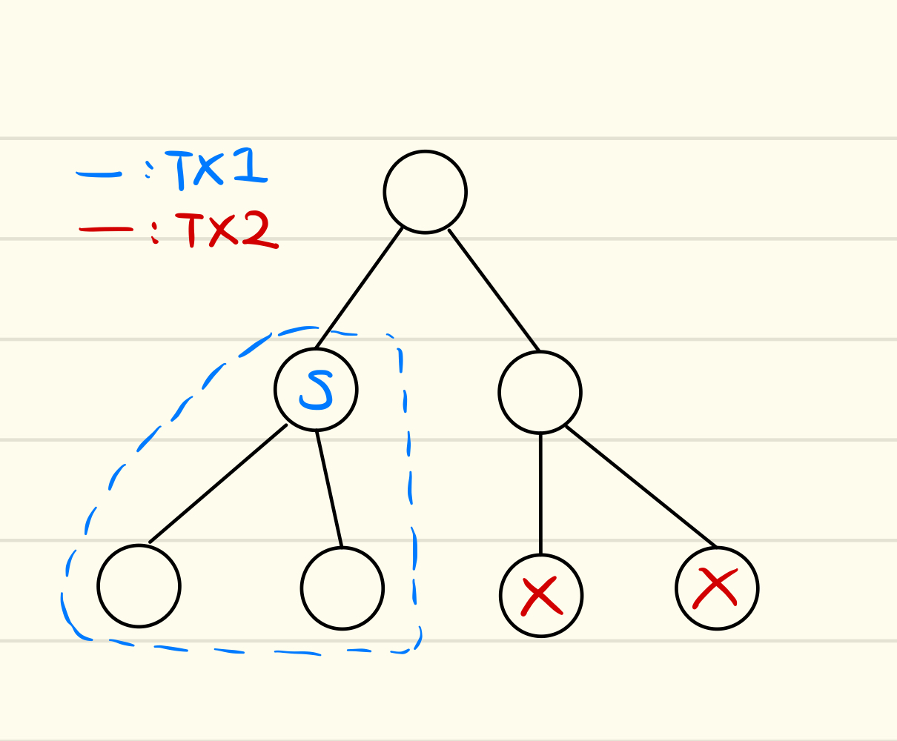
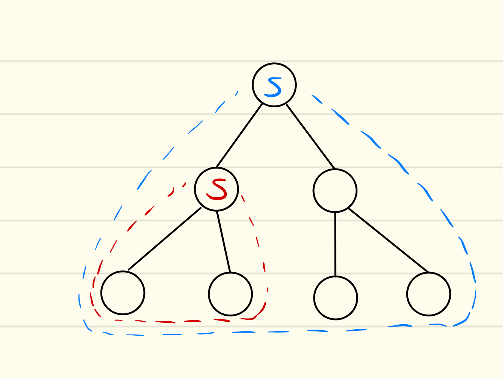
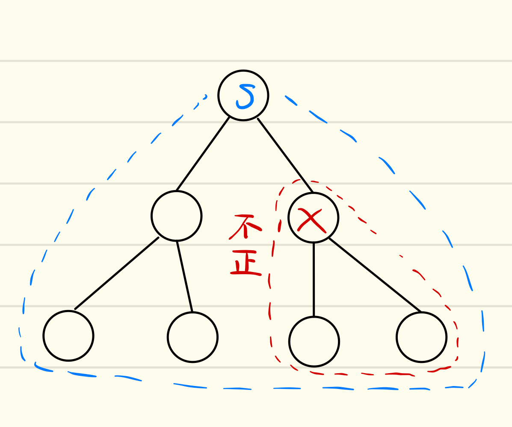
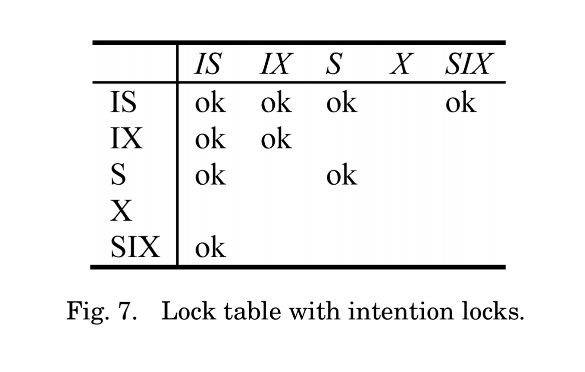
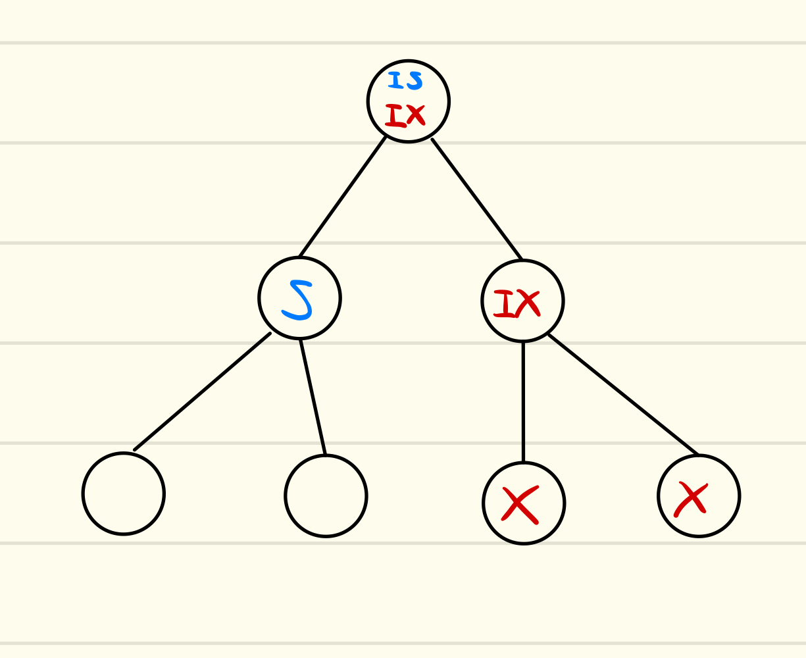
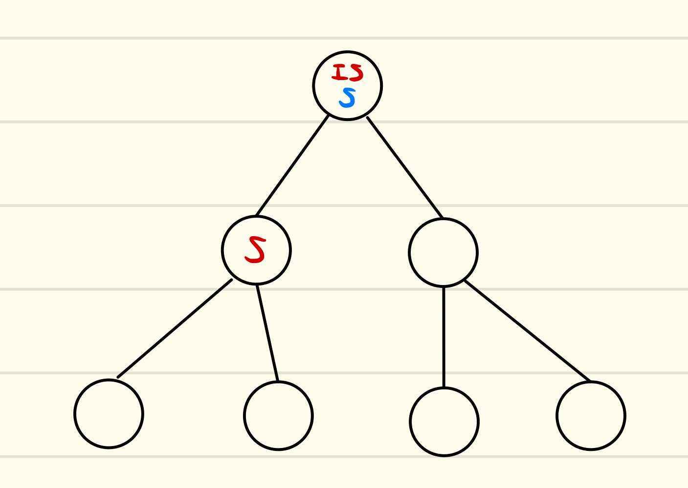
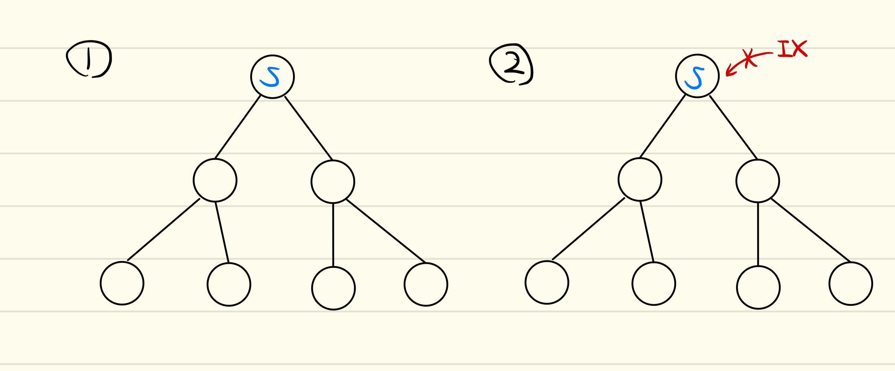
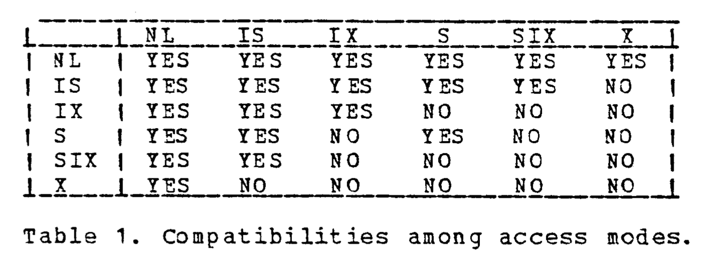

# multi granularity locking ([Granularity of Locks]より)
データベースで問題となるのは、lockする単位の選択であろう。lockする単位・粒度の選択は、concurrencyとlock機構
のトレードオフを決定する。

## 動機

粒度の高いlockは、少しの要素にのみアクセスするトランザクションとは相性が良い。これは、全体でlockされる範囲が最小限になり、
concurrencyをあげるからである。しかしながら、多くの要素にアクセスするトランザクションとは相性が悪い。これは、
lockするべき要素が多いことにより、lock managerへのアクセスが多くなることによるオーバーヘッド、さらにメモリの圧迫に
繋がる。

粒度の低いlockは逆に、多くの要素にアクセスするトランザクションとは相性が良く、少しの要素にのみアクセスするトランザクションとは相性が悪い。

まとめると、高い粒度を選択できれば排他制御される範囲が狭くなるのでconcurrencyがあがる。しかしlockのオーバーヘッドが大きくなる可能性がある。
低い粒度を選択できればlockのオーバーヘッドが小さいが、排他制御される範囲が広くなるのでconcurrencyは下がる。

これらの比較により、異なる粒度でlockできるようにすることが望ましいと考えられる。それを解決するのが、Multi granularity lockingである。

Multi granularity lockingは、いかのような方法で管理する。まずデータベース中のリソースを木構造で管理する。
次に、lockのモードとしてS(Shared)とX(Exclusive)を導入する。木構造中の各ノードにどちらかのmodeのlockをかけると、そのノード自身及び
**そのノードをrootするsubtree全体**が暗黙的にlockがかけられる。

この例では、一つのS lockが高さ1のnodeに、二つのX lockがleaf nodeにかけられている。色の違いは別々のトランザクションからのlockを表す。
S lockがかけられたnodeをrootするsubtree全体が、明示的なlockなしに、暗黙的にlockがかけられている。

この例では、二つのS lockがかけられている。S lockは共有lockなので、lockする領域が
二つのS lockで被っていいても問題ない。

この例ではS lockとX lockの領域が被っている。
S lockにより、ツリー全体が暗黙的にS lockになっている。これに対し、
別のトランザクションによるX lockがいくつかのノードにX lockをかけている。
つまり、いくつかのnodeは暗黙的に S lockとX lockがかかっていることになる。
X lockは排他lockなため、これは不正である。

キーポイントとなるのは、subtree全体のlockにより、いくつかのnodeが暗黙的にlockされる、
つまりそのnodeについてはlock managerに明記する必要がない、という点である。
またsubtree全体のlockにより、lockの粒度の違いを表現できる。

三つ目の例では、treeの一部がX lockされていることを見落としてtree全体にS lockをかけたため、
不正な状態となっている。

## Intention mode

tree全体を見ることによって、どのnodeが暗黙的にlockされているかどうかを知ることができる。
これをより効率的に検知することができるであろうか？
ここで導入されるのがIntention lockである。

> Intention mode is used to "tag" (lock) all ancestors of a node to be locked.
> These tags signal the fact that locking is being done at a "finer" level and
> prevent locks on the ancestors.

[Granularity of Locks]より引用。
Intention lockは、lockされるnodeのすべての祖先に対してタグつけを行うために使われる。
これらのタグはlockがある段階で行われていることを祖先に伝播し、祖先で不正なlockが行われることを防ぐ。

Intention lockのmodeは二つある。X lockをとるnodeの全ての祖先には、IX lockをとる必要がある。
S lockをとるnodeの全ての祖先には、ISまたはIX lockをとる必要がある。つまり、IX lockはSとXの両方に対して使え、
ISよりも強力なlockであると言える。このため、 IX lockの上にはIS lockをとることができない。
しかし、IS lockの上にはIX lockをとることができる。

S lockとX lockの互換性については自明だったが、ここでISとIX lockを組み込んだときの互換性について
まとめておく(SIXについては後述)。各Intention lock同士は同時に配置できる。
ISはSと互換性がある。これは、IS lockをかけられたnodeの下は常にSになることが保証されているからである。
これに対し、IXはS,Xとの互換性がない。Xは全てのlockに対し互換性がない。

ここで注意すべき点として、[Granularity of Locks]では、lockを取る順番、
例えば親から子へと向かってlockを取る、unlockの順番は子から親へと、といったような
細かな実装については述べられていない。特定のnodeにS/X lockをかけるにあたって、その祖先にもIS/IX lock
を取る、という操作がatomicに行われるものとして扱われている。

これは先ほどの一つ目の例に対応する。root nodeではIS・IXに互換性があるため
二つのlockが同時にかかっている

これは二つ目の例に対応。最初に赤のtransactionがlockをとったとしよう。青のトランザクションは
rootにS lockをとることを試みる。互換性がテーブより、SはISと互換性がある。よってS lockは成功。

これは三つ目の例に対応。最初に青がlockをとる。赤はX lockはとれるが、IX lockは取れない。
これにより、不正な状態を回避できる。

## SIXの導入

図の1のように、subtreeの多くのnodeをreadし、いくつかのnodeについてはwriteをするケースを考えてみよう。今までのmodeを組み合わせると、multi granularity lockingでは2あるいは3のようにして保護できるであろう。ここでは子nodeの数が高々6なのでどちらでも大差はないように感じられるが、ここでもし子nodeの数が100で、そのうち2個のnodeに対してwrite、それ以外は全てreadをするとしよう。その場合、2ではS lockを98個もとる必要があり、lockのオーバーヘッドが大きくなる。逆に、3のようなケースでは他のtransactionが子nodeのいくつかの要素のreadしかしないにも関わらずS lockが確保できなくなり、concurrencyが低下する。

このように、「subtreeのほとんど全てはreadし、いくつかの要素についてはwriteする」というのはよくあるパターンであるため、SIX(share adn intention exclusive) modeを導入する。SIXがnodeにかけられると、暗黙的にそれ以下のnodeにS lockをかける。また、SIXの直下には明示的にX,SIX,IX lockをかけることができる。これにより、今回のようなケースでは4のようにして保護できる。

互換性テーブルに書かれているように、SIXはISのみと互換性がある。これにより、他のtransactionがSIX下のnodeにS lockをかけることを許容できる。また、ISの下にはISかSのみ配置できるため、SIX下のIXやXとの競合を検知できる。つまり、SIXはISのみを通すようなフィルターとしての役割を果たすとも言える。

これはSIXによるsubtree全体の保護と、ISによる保護が共存している例である。

これは各modeどうし(NLはnull modeを表し、nodeがどのmodeでも保護されていない状態)の互換性を再びまとめたものである。XはNL状態のnodeにのみかけられ、他のmodeはXと共存しない。逆に、NL状態は全てのmodeと共存する。これにより、Xがもっとも強力で、NLがもっとも非力なlockと捉えることができる。すると、SIXはちょうどSとIXの両方の強さを掛け合わせた強さをもつlockとして捉えることができる。

## 各modeのまとめ

各modeについてまとめる。

- NL: 何もlockがかかっていない状態を表す
- IS: intention share lockを表し、直下のnodeをSかISで明示的に保護することを許容する。implicit lockingは行わない。
- IX: intention exclusive lockを表し、直下のnodeをX,S,SIX,IX,ISで明示的に保護することを許容する。implicit lockingは行わない。
- S: share lockを表し、この下の全てのnodeも暗黙的にS lockされる。
- SIX: share and intention exclusive lockを表し、この下の全てのnodeが暗黙的にS lockされる。また、直下のnodeをX,SIX,IXで明示的に保護することを許容する。
- X: exclusive lockを表し、この下の全てのnodeも暗黙的にS lockされる。

このmulti granularity lockingの理論は、一般には半順序集合に適用できる(つまり木構造ではなく親が二つ以上あるようなケース)。
この議論を木構造(hierarchy)に限定した時に、これはhierarchical lockingと呼べる。

## 参考文献
- [Granularity of Locks and Degrees of Consistency] Gray et al.

