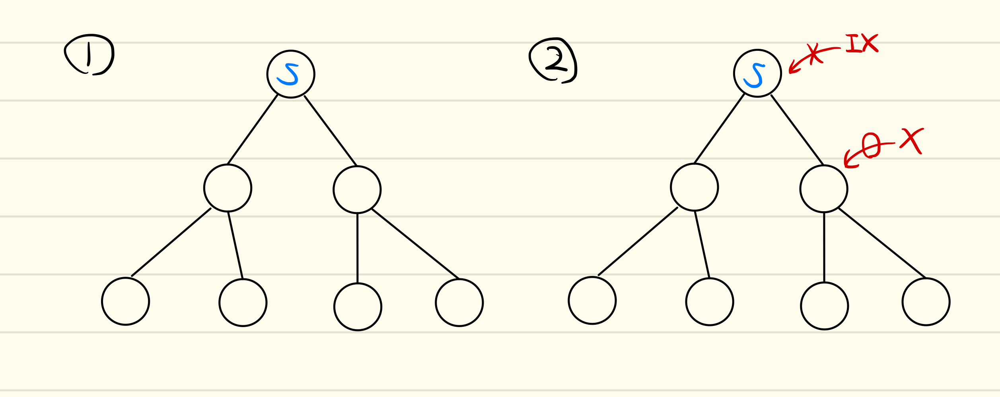

# multi granularity locking ([Granularity of Locks]より)
データベースで問題となるのは、lockする単位の選択であろう。lockする単位・粒度の選択は、concurrencyとlock機構
のトレードオフを決定する。
粒度の高いlockは、少しの要素にのみアクセスするトランザクションとは相性が良い。これは、lockされる範囲が最小限になり、
concurrencyをあげるからである。しかしながら、多くの要素にアクセスするトランザクションとは相性が悪い。これは、
lockするべき要素が多いことにより、lock managerへのアクセスが多くなることによるオーバーヘッド、さらにメモリの圧迫に
繋がる。

粒度の低いlockは逆に、多くの要素にアクセスするトランザクションとは相性が良く、少しの要素にのみアクセスするトランザクションとは相性が悪い。

まとめると、高い粒度を選択できれば排他制御される範囲が狭くなるのでconcurrencyがあがる。しかしlockのオーバーヘッドが大きくなる可能性がある。
低い粒度を選択できればlockのオーバーヘッドが小さいが、排他制御される範囲が広くなるのでconcurrencyは下がる。

これらの比較により、異なる粒度でlockできるようにすることが望ましいと考えられる。

Multi granularity lockingは、いかのような方法で管理する。まずデータベース中のリソースを木構造で管理する。
次に、lockのモードとしてS(Shared)とX(Exclusive)を導入する。木構造中の各ノードにどちらかのmodeのlockをかけると、そのノード自身及び
そのノードをrootするsubtree全体が暗黙的にlockがかけられる。

この例では、一つのS lockが高さ1のnodeに、二つのX lockがleaf nodeにかけられている。色の違いは別々のトランザクションからのlockを表す。
S lockがかけられたnodeをrootするsubtree全体が、明示的なlockなしに、暗黙的にlockがかけられている。

この例では、二つのS lockがかけられている。S lockは共有lockなので、lockする領域が
二つのS lockで被っていいても問題ない。

この例ではS lockとX lockの領域が被っている。
S lockにより、ツリー全体が暗黙的にS lockになっている。これに対し、
別のトランザクションによるX lockがいくつかのノードにX lockをかけている。
つまり、いくつかのnodeは暗黙的に S lockとX lockがかかっていることになる。
X lockは排他lockなため、これは不正である。

キーポイントとなるのは、sub tree全体のlockにより、いくつかのnodeが暗黙的にlockされる、
つまりそのnodeについてはlock managerに明記する必要がない、という点である。
またsub tree全体のlockにより、lockの粒度の違いを表現できる。

三つ目の例では、treeの一部がX lockされていることを見落としてtree全体にS lockをかけたため、
不正な状態となっている。どのようにして、走査しているnodeがすでに暗黙的にlockされている
かどうかを効率的に検知することができるであろうか？
ここで導入されるのがIntention lockである。

> Intention mode is used to "tag" (lock) all ancestors of a node to be locked.
> These tags signal the fact that locking is being done at a "finer" level and
> prevent locks on the ancestors.

[Granularity of Locks]より引用。
Intention lockは、lockされるnodeのすべての祖先に対してタグつけを行うために使われる。
これらのタグはlockがある段階で行われていることを祖先に伝播し、祖先で不正なlockが行われる
ことを防ぐ。

Intention lockのmodeは二つある。X lockをとるnodeの全ての祖先には、IX lockをとる必要がある。
S lockをとるnodeの全ての祖先には、ISまたはIX lockをとる必要がある。つまり、IX lockはSとXの両方に対して使え、
ISよりも強力なlockであると言える。このため、 IX lockの上にはIS lockをとることができない。
しかし、IS lockの上にはIX lockをとることができる。

S lockとX lockの互換性については自明だったが、ここでISとIX lockを組み込んだときの互換性について
まとめておく(SIXについては後述)。各Intention lock同士は同時に配置できる。
ISはSと互換性がある。これは、IS lockをかけられたnodeの下は常にSになることが保証されているからである。
これに対し、IXはS,Xとの互換性がない。Xは全てのlockに対し互換性がない。

ここで注意すべき点として、[Granularity of Locks]では、lockを取る順番、
例えば親から子へと向かってlockを取る、unlockの順番は子から親へと、といったような
細かな実装については述べられていない。特定のnodeにS/X lockをかけるにあたって、その祖先にもIS/IX lock
を取る、という操作がatomicに行われるものとして扱われている。

これは先ほどの一つ目の例に対応する。root nodeではIS・IXに互換性があるため
二つのlockが同時にかかっている

これは二つ目の例に対応。最初に赤のtransactionがlockをとったとしよう。青のトランザクションは
rootにS lockをとることを試みる。互換性がテーブより、SはISと互換性がある。よってS lockは成功。

これは三つ目の例に対応。最初に青がlockをとる。赤はX lockはとれるが、IX lockは取れない。
これにより、不正な状態を回避できる。

SIXは利便性のために導入され、ちょうどSとIXを組み合わせた強さのlockと
なっている。説明は省略。

このmulti granularity lockingの理論は、一般には半順序集合に適用できる(つまり木構造ではなく親が二つ以上あるようなケース)。
この議論を木構造(hierarchy)に限定した時に、これはhierarchical lockingと呼べる。

